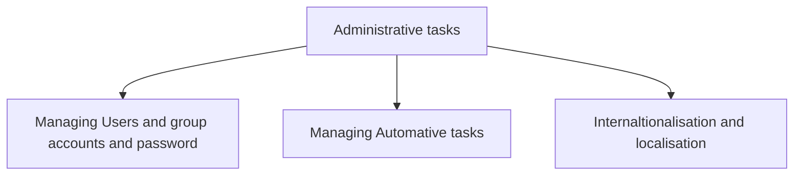

# Administrative tasks
This project summaries the duties and the day to day commands used by system admistrator.

> The first part talks about adding and managing user and group account as a system administrator
> The second part talks about about how to automate task as a system addmin
> The last part talks about managing time and timezone settings as a sysadmin

